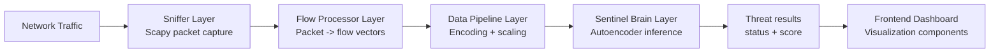
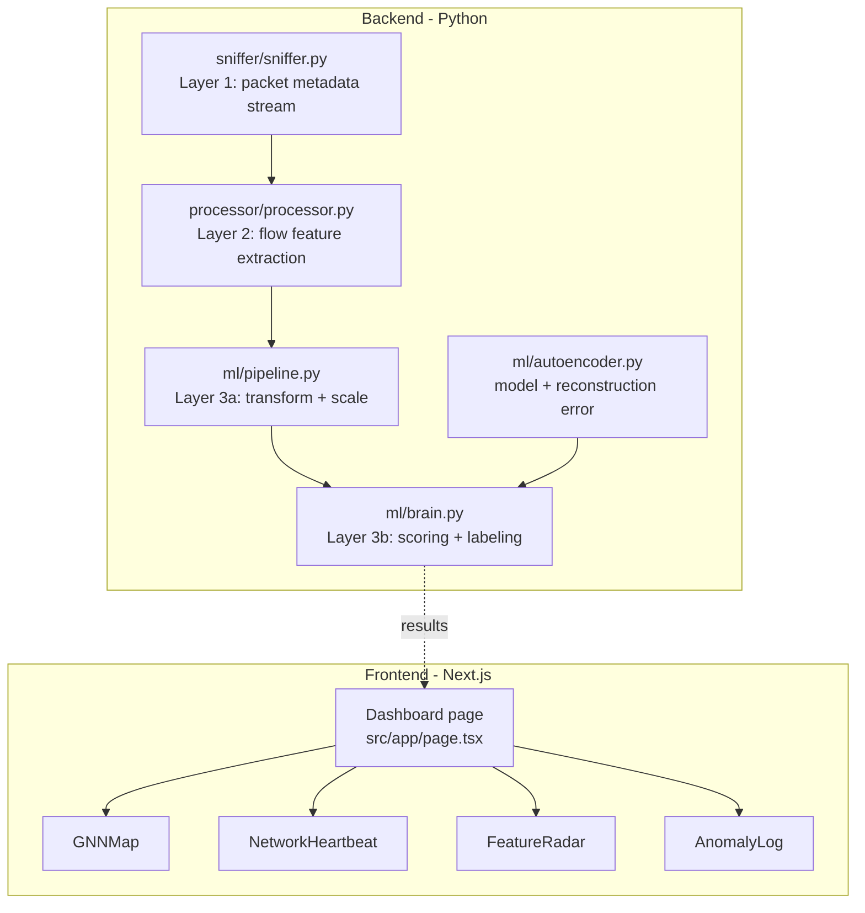
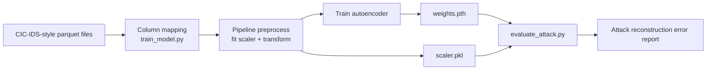

# GraphDefend Architecture

This document describes the architecture of GraphDefend based on the current repository implementation.

## 1. High-Level Overview

GraphDefend is structured as two major domains:

- Backend (Python): packet capture, flow feature engineering, preprocessing, ML inference, model training, and offline attack evaluation.
- Frontend (Next.js/React): security dashboard with live-style visual components (currently simulated state updates).

## 2. System Context

## 3. Component Architecture

## 4. Runtime Detection Flow (Online Path)

### Step-by-step

1. Packet capture
   - `sniffer.py` captures IP packets with Scapy and emits one JSON object per packet.
   - Metadata includes timestamps, source/destination IPs, protocol, ports, payload length, and TCP flags.

2. Flow aggregation
   - `FlowProcessor` groups packets into bidirectional 5-tuple-based flows over a configurable time window (`time_window_sec`, default 5s).
   - At window expiration, it emits a Pandas DataFrame where each row is a flow feature vector.

3. Feature preprocessing
   - `DataPipeline` applies:
     - log transform (`log1p`) on `total_bytes`,
     - protocol one-hot encoding (TCP, UDP, ICMP, OTHER),
     - MinMax scaling using a persisted scaler (`scaler.pkl`).

4. Inference and scoring
   - `SentinelBrain` runs vectors through the autoencoder and computes reconstruction error per flow.
   - Threat score is normalized as:
     - `threat_score = min(error / threshold, 1.0)`
   - Status mapping:
     - `< 0.4` -> Safe
     - `< 0.8` -> Warning
     - `>= 0.8` -> Critical (Anomaly Detected)

5. UI consumption
   - Frontend is currently wired with simulated updates in the dashboard.
   - The code is already structured for future live backend integration (commented Socket.IO hint).

## 5. Model Lifecycle (Offline Path)

### Training

- `train_model.py`:
  - loads parquet data,
  - maps dataset columns into Sentinel feature schema,
  - trains `AnomalyAutoencoder`,
  - saves `weights.pth` and scaler state (`scaler.pkl`).

### Evaluation

- `evaluate_attack.py`:
  - loads trained weights and scaler,
  - evaluates attack-labeled samples,
  - prints reconstruction-error-based detection outcomes.

## 6. Data Contracts

### Packet contract (Layer 1 output)

Key fields emitted by sniffer:

- `timestamp`, `time_hr`
- `src_ip`, `dst_ip`
- `protocol_name`, `src_port`, `dst_port`
- `payload_len`, `tcp_flags`

### Flow feature contract (Layer 2/3 input)

Core numerical fields:

- `total_packets`, `total_bytes`, `flow_duration_sec`
- `pkt_len_mean`, `pkt_len_max`, `pkt_len_min`, `pkt_len_std`
- `iat_mean`, `iat_max`
- `syn_count`, `ack_count`, `psh_count`, `fin_count`

Categorical field:

- `protocol` (mapped to one-hot columns in pipeline)

Metadata preserved for UI/result context:

- `flow_id`, `src_ip`, `dst_ip`

## 7. Design Choices

- Unsupervised anomaly detection
  - Autoencoder learns normal traffic structure; anomalies are detected via reconstruction error spikes.

- Windowed flow aggregation
  - Reduces packet-level noise and builds stable behavior features for ML.

- Deterministic preprocessing
  - Fixed one-hot protocol ordering and persisted scaler improve training/inference consistency.

- Layered backend modules
  - Sniffing, processing, preprocessing, and inference are separated, making replacement and testing easier.

## 8. Current Gaps and Evolution Path

- Frontend-backend integration is not fully connected yet.
  - Current dashboard logic uses simulation for threat and graph updates.

- Recommended integration path:
  1. Add a backend service endpoint (REST/WebSocket) that streams `SentinelBrain` results.
  2. Replace simulated frontend state updates with streamed server events.
  3. Add persistence (optional) for anomaly events and flow history.

## 9. File-to-Role Map

- `backend/sniffer/sniffer.py`: packet capture and JSON packet stream.
- `backend/processor/processor.py`: bidirectional flow grouping and feature vector creation.
- `backend/ml/pipeline.py`: one-hot encoding, transform, MinMax normalization, scaler persistence.
- `backend/ml/autoencoder.py`: model definition and reconstruction error function.
- `backend/ml/brain.py`: inference orchestration, threat score and status mapping.
- `backend/ml/train_model.py`: offline model training pipeline.
- `backend/ml/evaluate_attack.py`: offline attack evaluation pipeline.
- `frontend/src/app/page.tsx`: dashboard composition and simulation-driven UI behavior.
- `frontend/src/components/*`: visualization widgets.

## 10. Operational Notes

- Packet sniffing on Linux generally requires elevated privileges.
- The online path assumes scaler/model artifacts are available and compatible with feature dimensions.
- Threshold calibration (`threshold=0.05` in `SentinelBrain`) should be tuned for the target environment.
